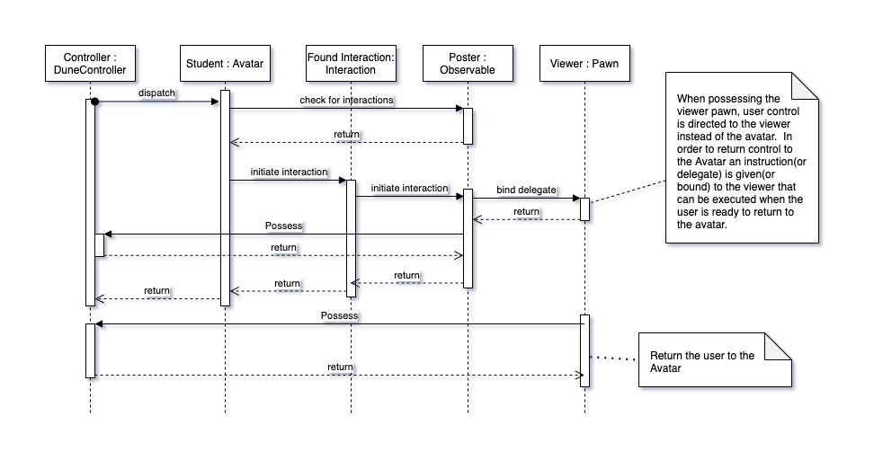

Poster Room
^^^^^^^^^^^

Requirements
^^^^^^^^^^^
1. vDUNE shall dynamically load poster content into slots (locations where posters can be positioned).
2. vDUNE shall update the angle of view directly in front of the poster when the user initiates an interaction with the poster.
3. vDUNE shall update the angle of view to the avatar's perspective when the user ends the interaction with the poster.
4. While interacting with the poster, vDUNE shall move the angle of view as the user commands.

.. image:: PosterRoom/Observable.jpg
  :width: 900
  :alt: Alternative text

